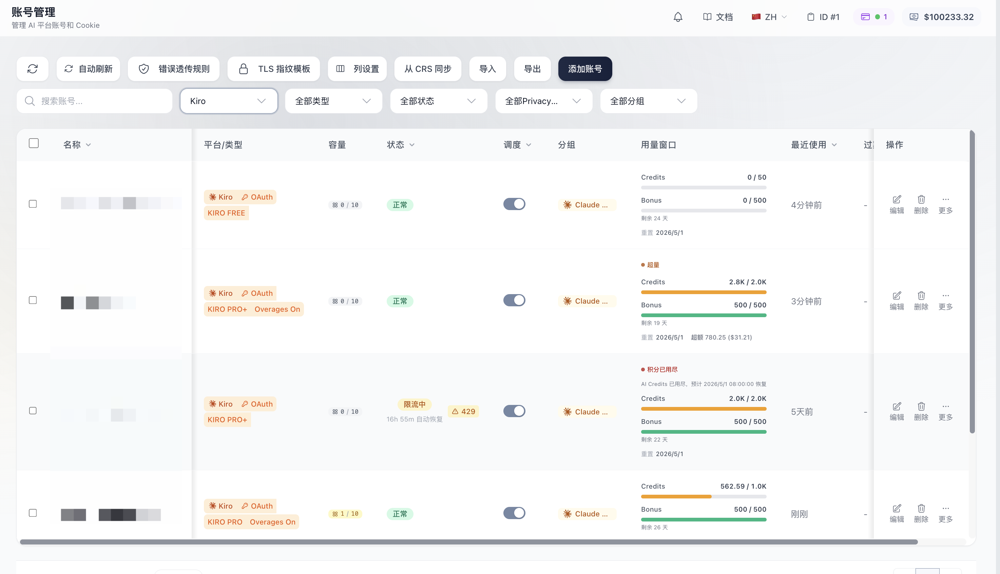
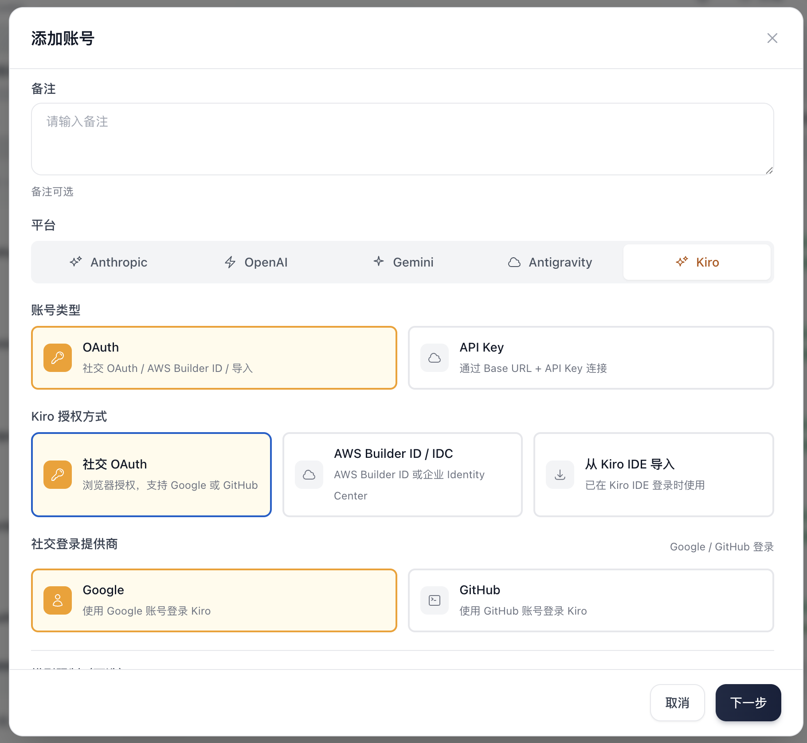
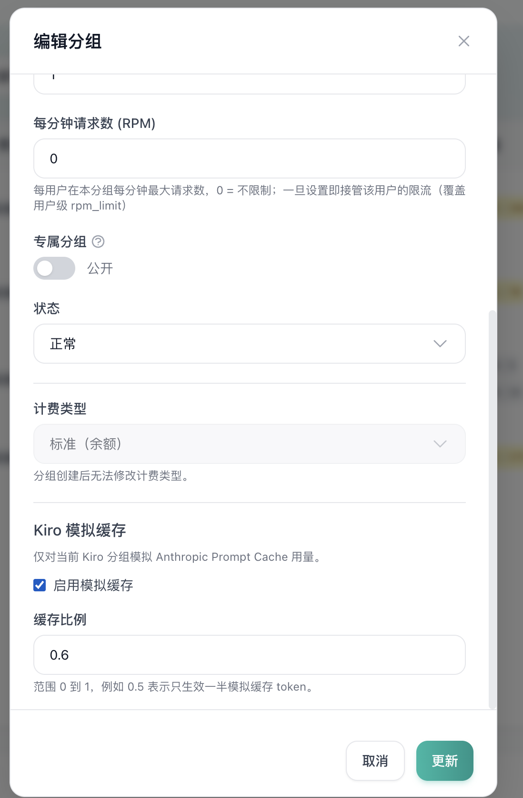

# Sub2API Kiro

<div align="center">

[](https://golang.org/)
[](https://vuejs.org/)
[](https://www.postgresql.org/)
[](https://redis.io/)
[](https://www.docker.com/)

**Kiro-Enhanced AI API Gateway**

**GPT-5.6 Sol / Terra / Luna | Claude Opus 4.8 | Claude Sonnet 5**

English | [中文](README_CN.md) | [日本語](README_JA.md)

</div>

## Overview

Sub2API is an AI API gateway platform designed to distribute and manage API quotas from AI product subscriptions. Users can access upstream AI services through platform-generated API Keys, while the platform handles authentication, billing, load balancing, and request forwarding.

## Kiro-Enabled Distribution

This independent distribution tracks stable updates from [Wei-Shaw/sub2api](https://github.com/Wei-Shaw/sub2api) while maintaining first-class Kiro support.

Kiro-specific capabilities include:

- Kiro channel support, including OAuth / AWS Builder ID / token import and API-key-compatible upstream access.
- OpenAI Responses and Chat Completions protocol bridging for Kiro accounts.
- Anthropic Prompt Cache usage emulation for Kiro traffic, with per-group enablement and adjustable ratios.
- Kiro model compatibility for GPT-5.6 Sol, Terra, and Luna; Claude Opus 4.8; and Claude Sonnet 5, including established model aliases.

## Kiro Screenshots

<p align="center">
  
</p>

<p align="center">
  
  
</p>

## Features

- **Multi-Account Management** - Support multiple upstream account types (OAuth, API Key)
- **API Key Distribution** - Generate and manage API Keys for users
- **Precise Billing** - Token-level usage tracking and cost calculation
- **Smart Scheduling** - Intelligent account selection with sticky sessions
- **Concurrency Control** - Per-user and per-account concurrency limits
- **Rate Limiting** - Configurable request and token rate limits
- **Kiro Channel Support** - Kiro accounts are available through native Anthropic, OpenAI Responses, and Chat Completions compatible gateways
- **Kiro Model Compatibility** - Support for GPT-5.6, Claude Opus 4.8, and Claude Sonnet 5 model aliases
- **Kiro Cache Emulation** - Simulate Anthropic Prompt Cache usage for Kiro groups with adjustable per-group emulation ratio
- **Built-in Payment System** - Supports EasyPay, Alipay, WeChat Pay, and Stripe for user self-service top-up, no separate payment service needed ([Configuration Guide](docs/PAYMENT.md))
- **Admin Dashboard** - Web interface for monitoring and management
- **External System Integration** - Embed external systems (e.g. ticketing) via iframe to extend the admin dashboard

## Ecosystem

Community projects that extend or integrate with Sub2API:

| Project | Description | Features |
|---------|-------------|----------|
| ~~[Sub2ApiPay](https://github.com/touwaeriol/sub2apipay)~~ | ~~Self-service payment system~~ | **Now Built-in** — Payment is now integrated into Sub2API, no separate deployment needed. See [Payment Configuration Guide](docs/PAYMENT.md) |
| [sub2api-mobile](https://github.com/ckken/sub2api-mobile) | Mobile admin console | Cross-platform app (iOS/Android/Web) for user management, account management, monitoring dashboard, and multi-backend switching; built with Expo + React Native |

## Tech Stack

| Component | Technology |
|-----------|------------|
| Backend | Go 1.25.7, Gin, Ent |
| Frontend | Vue 3.4+, Vite 5+, TailwindCSS |
| Database | PostgreSQL 15+ |
| Cache/Queue | Redis 7+ |

---

## Nginx Reverse Proxy Note

When using Nginx as a reverse proxy for Sub2API (or CRS) with Codex CLI, add the following to the `http` block in your Nginx configuration:

```nginx
underscores_in_headers on;
```

Nginx drops headers containing underscores by default (e.g. `session_id`), which breaks sticky session routing in multi-account setups.

---

## Deployment

### Method 1: Docker Compose (Recommended)

Deploy with Docker Compose, including PostgreSQL and Redis containers.

#### Prerequisites

- Docker 20.10+
- Docker Compose v2+

#### Quick Start

```bash
# Clone this distribution and enter its deployment directory
git clone https://github.com/tamakiramimy/sub2api-kiro.git
cd sub2api-kiro/deploy

# Configure deployment secrets
cp .env.example .env
chmod 600 .env

# Build the local Kiro image and start services
docker compose -f docker-compose.local.yml up -d --build

# View logs
docker compose -f docker-compose.local.yml logs -f sub2api
```

#### Manual Deployment

If you prefer manual setup:

```bash
# 1. Clone the repository
git clone https://github.com/tamakiramimy/sub2api-kiro.git
cd sub2api-kiro/deploy

# 2. Copy environment configuration
cp .env.example .env

# 3. Edit configuration (generate secure passwords)
nano .env
```

**Required configuration in `.env`:**

```bash
# PostgreSQL password (REQUIRED)
POSTGRES_PASSWORD=your_secure_password_here

# JWT Secret (RECOMMENDED - keeps users logged in after restart)
JWT_SECRET=your_jwt_secret_here

# TOTP Encryption Key (RECOMMENDED - preserves 2FA after restart)
TOTP_ENCRYPTION_KEY=your_totp_key_here

# Optional: Admin account
ADMIN_EMAIL=admin@example.com
ADMIN_PASSWORD=your_admin_password

# Optional: Custom port
SERVER_PORT=8080
```

**Generate secure secrets:**
```bash
# Generate JWT_SECRET
openssl rand -hex 32

# Generate TOTP_ENCRYPTION_KEY
openssl rand -hex 32

# Generate POSTGRES_PASSWORD
openssl rand -hex 32
```

```bash
# 4. Create data directories (for local version)
mkdir -p data postgres_data redis_data

# 5. Start all services
# Option A: Local directory version (recommended - easy migration)
docker compose -f docker-compose.local.yml up -d --build

# Option B: Named volumes version (simple setup)
docker compose up -d --build

# 6. Check status
docker compose -f docker-compose.local.yml ps

# 7. View logs
docker compose -f docker-compose.local.yml logs -f sub2api
```

#### Deployment Versions

| Version | Data Storage | Migration | Best For |
|---------|-------------|-----------|----------|
| **docker-compose.local.yml** | Local directories | ✅ Easy (tar entire directory) | Production, frequent backups |
| **docker-compose.yml** | Named volumes | ⚠️ Requires docker commands | Simple setup |

**Recommendation:** Use `docker-compose.local.yml` for easier data management.

#### Access

Open `http://YOUR_SERVER_IP:8080` in your browser.

If admin password was auto-generated, find it in logs:
```bash
docker compose -f docker-compose.local.yml logs sub2api | grep "admin password"
```

#### Upgrade

```bash
# Rebuild the local image and recreate the application container
docker compose -f docker-compose.local.yml build --pull sub2api
docker compose -f docker-compose.local.yml up -d
```

#### Easy Migration (Local Directory Version)

When using `docker-compose.local.yml`, migrate to a new server easily:

```bash
# On source server
docker compose -f docker-compose.local.yml down
cd ..
tar czf sub2api-complete.tar.gz sub2api-deploy/

# Transfer to new server
scp sub2api-complete.tar.gz user@new-server:/path/

# On new server
tar xzf sub2api-complete.tar.gz
cd sub2api-deploy/
docker compose -f docker-compose.local.yml up -d
```

#### Useful Commands

```bash
# Stop all services
docker compose -f docker-compose.local.yml down

# Restart
docker compose -f docker-compose.local.yml restart

# View all logs
docker compose -f docker-compose.local.yml logs -f

# Remove all data (caution!)
docker compose -f docker-compose.local.yml down
rm -rf data/ postgres_data/ redis_data/
```

---

### Method 2: Build from Source

Build and run from source code for development or customization.

#### Prerequisites

- Go 1.26.5
- Node.js 24+
- pnpm 9
- PostgreSQL 15+
- Redis 7+

#### Build Steps

```bash
# 1. Clone the repository
git clone https://github.com/tamakiramimy/sub2api-kiro.git
cd sub2api-kiro

# 2. Enable the lockfile-compatible pnpm version
corepack enable
corepack prepare pnpm@9 --activate

# 3. Build frontend
cd frontend
pnpm install
pnpm run build
# Output will be in ../backend/internal/web/dist/

# 4. Build backend with embedded frontend
cd ../backend
go build -tags embed -o sub2api ./cmd/server

# 5. Create configuration file
cp ../deploy/config.example.yaml ./config.yaml

# 6. Edit configuration
nano config.yaml
```

> **Note:** The `-tags embed` flag embeds the frontend into the binary. Without this flag, the binary will not serve the frontend UI.

**Key configuration in `config.yaml`:**

```yaml
server:
  host: "0.0.0.0"
  port: 8080
  mode: "release"

database:
  host: "localhost"
  port: 5432
  user: "postgres"
  password: "your_password"
  dbname: "sub2api"

redis:
  host: "localhost"
  port: 6379
  password: ""

jwt:
  secret: "change-this-to-a-secure-random-string"
  expire_hour: 24

default:
  user_concurrency: 5
  user_balance: 0
  api_key_prefix: "sk-"
  rate_multiplier: 1.0
```

### Sora Status (Temporarily Unavailable)

> ⚠️ Sora-related features are temporarily unavailable due to technical issues in upstream integration and media delivery.
> Please do not rely on Sora in production at this time.
> Existing `gateway.sora_*` configuration keys are reserved and may not take effect until these issues are resolved.

Additional security-related options are available in `config.yaml`:

- `cors.allowed_origins` for CORS allowlist
- `security.url_allowlist` for upstream/pricing/CRS host allowlists
- `security.url_allowlist.enabled` to disable URL validation (use with caution)
- `security.url_allowlist.allow_insecure_http` to allow HTTP URLs when validation is disabled
- `security.url_allowlist.allow_private_hosts` to allow private/local IP addresses
- `security.response_headers.enabled` to enable configurable response header filtering (disabled uses default allowlist)
- `security.csp` to control Content-Security-Policy headers
- `billing.circuit_breaker` to fail closed on billing errors
- `server.trusted_proxies` to enable X-Forwarded-For parsing
- `turnstile.required` to require Turnstile in release mode

**⚠️ Security Warning: HTTP URL Configuration**

When `security.url_allowlist.enabled=false`, the system performs minimal URL validation by default, **rejecting HTTP URLs** and only allowing HTTPS. To allow HTTP URLs (e.g., for development or internal testing), you must explicitly set:

```yaml
security:
  url_allowlist:
    enabled: false                # Disable allowlist checks
    allow_insecure_http: true     # Allow HTTP URLs (⚠️ INSECURE)
```

**Or via environment variable:**

```bash
SECURITY_URL_ALLOWLIST_ENABLED=false
SECURITY_URL_ALLOWLIST_ALLOW_INSECURE_HTTP=true
```

**Risks of allowing HTTP:**
- API keys and data transmitted in **plaintext** (vulnerable to interception)
- Susceptible to **man-in-the-middle (MITM) attacks**
- **NOT suitable for production** environments

**When to use HTTP:**
- ✅ Development/testing with local servers (http://localhost)
- ✅ Internal networks with trusted endpoints
- ✅ Testing account connectivity before obtaining HTTPS
- ❌ Production environments (use HTTPS only)

**Example error without this setting:**
```
Invalid base URL: invalid url scheme: http
```

If you disable URL validation or response header filtering, harden your network layer:
- Enforce an egress allowlist for upstream domains/IPs
- Block private/loopback/link-local ranges
- Enforce TLS-only outbound traffic
- Strip sensitive upstream response headers at the proxy

```bash
# 6. Run the application
./sub2api
```

#### Development Mode

```bash
# Backend (with hot reload)
cd backend
go run ./cmd/server

# Frontend (with hot reload)
cd frontend
pnpm run dev
```

#### Code Generation

When editing `backend/ent/schema`, regenerate Ent + Wire:

```bash
cd backend
go generate ./ent
go generate ./cmd/server
```

---

## Simple Mode

Simple Mode is designed for individual developers or internal teams who want quick access without full SaaS features.

- Enable: Set environment variable `RUN_MODE=simple`
- Difference: Hides SaaS-related features and skips billing process
- Security note: In production, you must also set `SIMPLE_MODE_CONFIRM=true` to allow startup

---

## Antigravity Support

Sub2API supports [Antigravity](https://antigravity.so/) accounts. After authorization, dedicated endpoints are available for Claude and Gemini models.

### Dedicated Endpoints

| Endpoint | Model |
|----------|-------|
| `/antigravity/v1/messages` | Claude models |
| `/antigravity/v1beta/` | Gemini models |

### Claude Code Configuration

```bash
export ANTHROPIC_BASE_URL="http://localhost:8080/antigravity"
export ANTHROPIC_AUTH_TOKEN="sk-xxx"
```

### Hybrid Scheduling Mode

Antigravity accounts support optional **hybrid scheduling**. When enabled, the general endpoints `/v1/messages` and `/v1beta/` will also route requests to Antigravity accounts.

> **⚠️ Warning**: Anthropic Claude and Antigravity Claude **cannot be mixed within the same conversation context**. Use groups to isolate them properly.

### Known Issues

In Claude Code, Plan Mode cannot exit automatically. (Normally when using the native Claude API, after planning is complete, Claude Code will pop up options for users to approve or reject the plan.)

**Workaround**: Press `Shift + Tab` to manually exit Plan Mode, then type your response to approve or reject the plan.

---

## Project Structure

```
sub2api/
├── backend/                  # Go backend service
│   ├── cmd/server/           # Application entry
│   ├── internal/             # Internal modules
│   │   ├── config/           # Configuration
│   │   ├── model/            # Data models
│   │   ├── service/          # Business logic
│   │   ├── handler/          # HTTP handlers
│   │   └── gateway/          # API gateway core
│   └── resources/            # Static resources
│
├── frontend/                 # Vue 3 frontend
│   └── src/
│       ├── api/              # API calls
│       ├── stores/           # State management
│       ├── views/            # Page components
│       └── components/       # Reusable components
│
└── deploy/                   # Deployment files
    ├── docker-compose.yml    # Docker Compose configuration
  ├── docker-compose.local.yml # Docker Compose with local data directories
    ├── .env.example          # Environment variables for Docker Compose
    ├── config.example.yaml   # Full config file for binary deployment
  └── README.md             # Deployment reference
```

## Disclaimer

> **Please read carefully before using this project:**
>
> :rotating_light: **Terms of Service Risk**: Using this project may violate Anthropic's Terms of Service. Please read Anthropic's user agreement carefully before use. All risks arising from the use of this project are borne solely by the user.
>
> :book: **Disclaimer**: This project is for technical learning and research purposes only. The author assumes no responsibility for account suspension, service interruption, or any other losses caused by the use of this project.

---

## License

This project is licensed under the [GNU Lesser General Public License v3.0](LICENSE) (or later).

Copyright (c) 2026 Wesley Liddick

---

<div align="center">

**If you find this project useful, please give it a star!**

</div>
